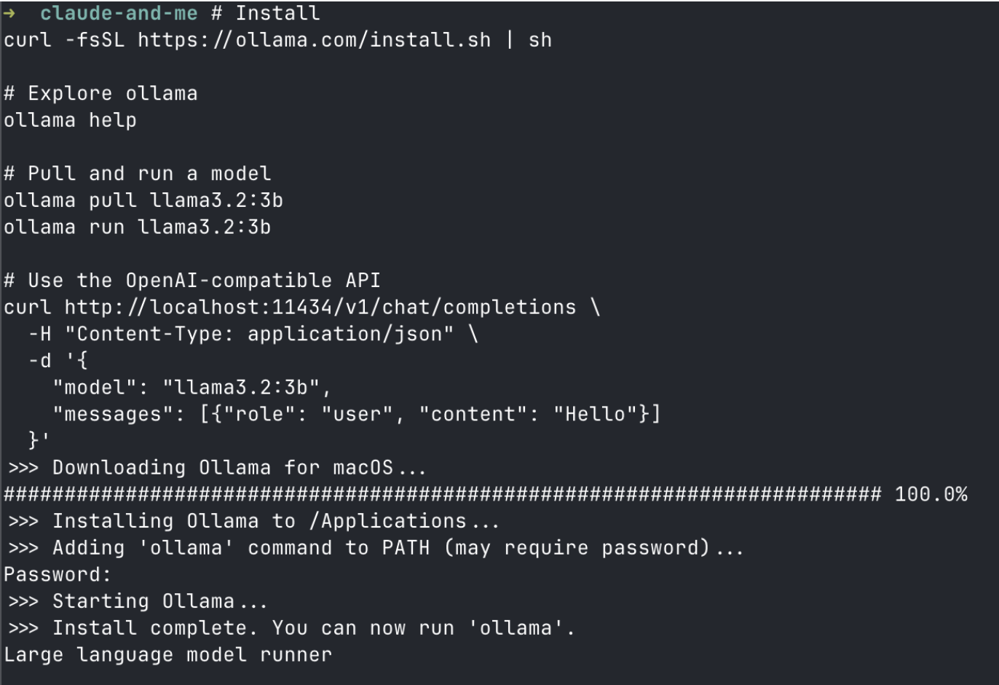
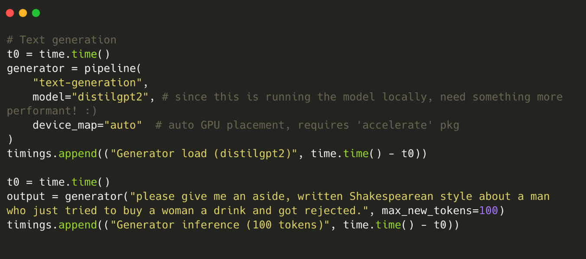
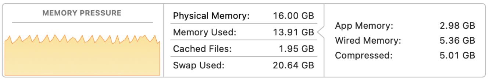

AI usage is exploding in 2026. Claude, ChatGPT. But there's a whole universe of models outside the 'frontier' models, some which you can download and run locally!

This is a quick investigation of running models locally, using an external provider, and Modal, an inference provider that's a combination of the two.

So what are these more open models, how can we run them, and what does 'open' mean to us? We'll dive into downloading and running these models locally in this project:

# Running Local Models

> Inference: process of passing an input to a model, and producing an output.
> Training / fine-tuning: Process of adjusting the model's weights to adjust model behavior

ollama.com is a great place to get started with local models. It makes setup extremely easy, with a list of models for users to download and get running.

To start interacting with a model locally, it's as simple as:

```bash
curl -fsSL https://ollama.com/install.sh | sh

# Explore ollama
ollama help

# Pull and run a model
ollama pull llama3.2:3b
ollama run llama3.2:3b
```

And boom! You should be up and running with a model locally:



Ollama is a nice wrapper around llama.cpp, an inference engine written in C++.

> inference engine? What do you mean?

The model by itself is just a collection of static weights — just like a large file of numbers. To produce an output, we need to take an input and pass it through the model!

We'd like this program to be as efficient as possible, so thank you to `llama.cpp` maintainers!

Ollama wraps llama.cpp so we don't have to think about it as much. If you'd like to adjust finer controls, get more performance, or manage the model yourself, best to look into running `llama.cpp` yourself.

If you're already bored with running a model locally, you probably want to look at fine-tuning.

## Hugging Face's Transformers Library

HuggingFace has a `transformers` Python library for machine learning research and inference. The HF format standardizes models, so you only need to learn one API scheme across the model providers (DeepSeek, Mistral, Meta's Llama, Kimi, etc...). Python is a little slower for inference, but HF's library is really for research and training, not serving models at scale.

### Pipelines, Generators

I'm using HF's tutorial to understand Pipelines. You first define your 'pipeline' and inference method, model, with an additional argument for device (CPU or GPU). A `pipeline()` object defines the transformation your input will take. Then, you pass this to a `generator()` to run inference.


## GPU-obsession

If you haven't tried to run a model locally, you're likely used to waiting around at a chat interface for your answer. _This is so slow!_, you've thought at least once. It's amazing what we can take for granted, because this process is even slower locally. On my 2020 M1 Macbook Air with 16GB RAM, the best I could manage was `distilgpt2`, [a tiny version of GPT2](https://huggingface.co/distilbert/distilgpt2) from HuggingFace at 88 million parameters.

88 million parameters is **nothing** compared to the current models these days, easily averaging **hundreds of billions**!

The performance bottleneck is evident when you see both models, side by side on the same Shakespeare prompt:

Prompt: "please give me an aside, written Shakespearean style about a man who just tried to buy a woman a drink and got rejected."

```md
================================================
Step                                  Time     %
------------------------------------------------
Classifier load                     12.20s    3%
Classifier inference                39.48s    9%
Generator load (distilgpt2)          1.26s    0% # 80 million params
Generator inference (100 tokens)     1.34s    0%
Generator load (HF smol)           404.39s   88% # 3 billion params
------------------------------------------------
TOTAL                              458.68s
================================================
```


In CPU mode, the model's weights are loaded into RAM. Running this simple prompt took >9GB of my 16GB alone for the model weights, which adds up quickly.

If we want to run more powerful models, and run them faster, we'll need to delegate to GPUs. They excel at inference (thousands of matrix multiplication operations), and ship with large VRAM (faster access memory that most models now leverage).

> Most models and ML libraries optimize for CUDA, the underlying software Nvidia GPUs run on... if everyone needs GPUs, and Nvidia is the biggest player... it makes sense they're a multi-trillion dollar company now.

### Self-hosting:

To recap, Ollama and this Hugging Face example are _self-hosted_, as in I'm in charge. I have the weights on my computer, I am standing up the model endpoint myself. I don't need an API key (except to speed up the model download), but I'm not paying anyone each time I make a model query.

**Pros:**
- LLM calls are free!
- Secure (I own my data)
- Free to modify and adjust the model when I want

**Cons:**
- slow inference (I'm limited by my Macbook's processing power)
- I don't want to become an inference provider!

So self-hosting is out for me. There are a range of options that fall between hosting a model locally and paying OpenAI, though. Let's dive into the space!

# There are Many Options for Serving Models

There are so many options for serving a model now. Broadly, we optimize along 4 axes:
1) Cost
2) Latency (speed)
3) Ease-of-use
4) _Privacy_

The setup for your use case depends on what you'd like. In most cases, #4 isn't relevant, but worth mentioning for sensitive data.

Our Fractal document's decision tree explains it better than I can:
```
Need a quick prototype?         --> Ollama locally or Groq API
Need production serving?        --> vLLM self-hosted, Together AI, or Modal
Need to try many models?        --> OpenRouter (unified API)
Need fine-tuning?               --> Together AI or Hugging Face
Need absolute lowest latency?   --> Groq or self-hosted on GPU
Need absolute lowest cost?      --> Self-hosted with Ollama/vLLM
Need serverless GPU (no idle $) --> Modal (scale-to-zero, bring your own model)
Need privacy/compliance?        --> Self-hosted only
```

Groq, Cerebras -> (inference provider). They have their own chips that run the models faster.

OpenRouter -> provides a consistent API to access many models, so you can switch seamlessly, try many, or have model backups.

Modal -> pay for your use, spin down otherwise

Let's benchmark them. Since we tested Ollama above, I'll talk about Groq and Modal:


## Groq
- Inference provider with their own LPU chip, designed for inference
- Requires an API_KEY, but in return you get super-fast results!
- Limited to their model offerings

> TL;DR Groq is "ChatGPT but faster". They choose a few models to run on their LPU chips, and they charge per token just like OpenAI / ChatGPT.

## Modal (My love!)
- Serverless GPU provider - allows you to BYOM (bring your own models)
- Train models, store the built model image, and pay only for when the GPU is active
- Great pricing scheme, and extremely affordable so far

I've used Modal before, to generate Gaussian splats. Modal offers serverless GPUs and quick starts, allowing us to train and run models like from HuggingFace in the cloud. A common workflow is to pull HuggingFace models into Modal containers to build the model image. Each API call to your model is then sent to Modal, spinning up your model when needed. These containers can scale with demand and scale down.

> TL;DR Modal is managed GPU infrastructure. Build and serve your model in a serverless fashion.


## Benchmarking: Modal vs Groq

For this comparison, we'll run a beefier model – `openai/gpt-oss-20b` – on both providers with the same Shakespeare prompt.

### Modal

Modal's documentation is great – you're able to wrap your python functions in decorators, that tell Modal what to send to a GPU. [My code is hosted here.](https://github.com/joshupadhyay/nonfrontier/blob/main/src/modal_gpt_oss.py)

| Run | GPU  | Model Load | Inference (256 tokens) | Total (w/ Modal) | Notes                          |
|-----|------|------------|------------------------|------------------|--------------------------------|
| 1   | A10  | 36.64s     | 24.73s                 | 78.34s           | First run, no volume           |
| 2   | A10  | 70.70s     | 31.08s                 | 122.28s          | Modal Volume (cached)          |
| 3   | A10G | 21.59s     | 47.10s                 | 84.53s           | A10G — lower memory bandwidth  |
| 4   | A10  | 9.27s      | 31.54s                 | 54.98s           | Warm container / cached volume |
| 5   | A10  | 11.25s     | 30.81s                 | 56.59s           | Warm container / cached volume |

I fixed an error with caching in the second run (122s). From there, you can see how much faster the warmed container runs, in about 50s. The change from 122 -> 84 seconds is due to a Modal Volume (the model weights are saved to Modal, so we don't need to download from HuggingFace directly again).

### Groq

Groq absolutely incinerates our Modal runs, finishing in **less than a second!** Their custom LPU chip is purpose-built for inference — it's blazing fast, and they don't need to 'load' model weights in like our Modal model. [Here's my code.](https://github.com/joshupadhyay/nonfrontier/blob/main/src/groq_gpt_oss.py)

```
**Aside:**

Hark! I, with hopeful heart, did seek to bid
A humble draught to sweeten fair‑she's gaze;
Yet, like a wilted rose beneath the sun,
My offering found no favor in her eyes.

She turned her gaze as if the world were veiled,
And whispered, "No, good sir, this cup is mine."
I felt the sting of winter in my breast,
Yet, proud of love, I must endure this grief.

For love, that fragile bird, oft flies unmoored—
I'll keep my hope aloft, though now I'm scorned.

=========================================
Step                           Time     %
-----------------------------------------
Client init                   0.05s    7%
Time to first token           0.24s   35%
Streaming (first to last)     0.39s   57%
Total API call                0.68s  100%
=========================================
```


## Cost Estimate

|                         | Groq    | Modal    |
| ----------------------- | ------- | -------- |
| Cost per call           | ~$0.004 | ~$0.026  |
| Latency (your runs)     | ~1s     | ~55s     |
| **Cost for 1000 calls** | **~$4** | **~$26** |
Groq is extremely cheap for this use case. Even at max output, a single call costs less than half a cent.

Groq is **~6x cheaper and ~20x faster** for this model. The tradeoff is you don't control the infrastructure — Modal gives you full control over the GPU, model version, and configuration.

Sources:

- [Modal Pricing](https://modal.com/pricing)
- [Groq Pricing](https://groq.com/pricing)
- [Groq GPT-OSS Pricing Update](https://groq.com/blog/gpt-oss-improvements-prompt-caching-and-lower-pricing)


## So why bother Using Modal?

This was a completely unfair battle, to Modal's credit. Groq natively supports this model on optimized hardware — we're comparing pure _inference_, which Modal isn't designed for. If I wanted to fine-tune GPT-OSS, then I'd need infrastructure with a ton of GPUs, a stable connection, and ability to scale up and down on workload. Groq is only an inference provider and would not work for this use case.
